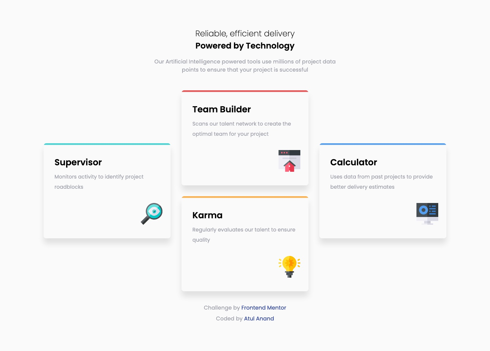
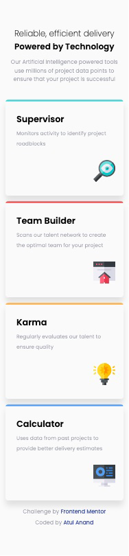

# Frontend Mentor - Four card feature section

## The challenge

Your challenge is to build out this feature section and get it looking as close to the design as possible.

You can use any tools you like to help you complete the challenge. So if you've got something you'd like to practice, feel free to give it a go.

Your users should:

- View the optimal layout for the site depending on their device's screen size

### Screenshots

### Links

- Solution URL: [Github](https://github.com/atulanand206/fem-four-card-feature)
- Live Site URL: [Netlify](https://fem-four-card-feature.netlify.app/)

## My process

- Figure out the semantic HTML elements. Worked out without the need of css classes.
- Assigned the font weights to make it look close to the prototype.
- Had to introduce the classes while placing them in the grid and for the colors before the cards.
- Icons were fairly simple to place as I fixed the height of cards.

### Built with

- Semantic HTML5 markup
- CSS custom properties
- Flexbox
- CSS Grid
- Mobile-first workflow

### What I learned

- `::before` selector is sweet.
- Multiple attributes can be applied using multiple selector classes.

## Author

- Atul Anand

## Acknowledgments

Thanks to [Kevin Powell](https://www.youtube.com/channel/UCJZv4d5rbIKd4QHMPkcABCw) for the focused YT tutorials.
